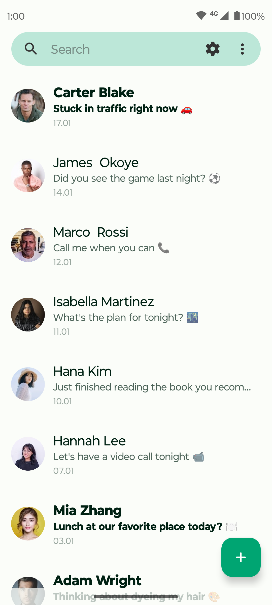
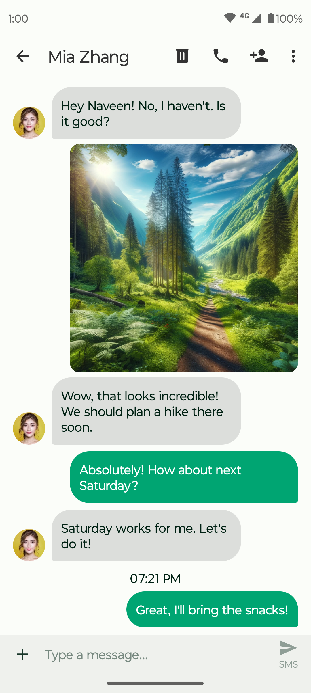
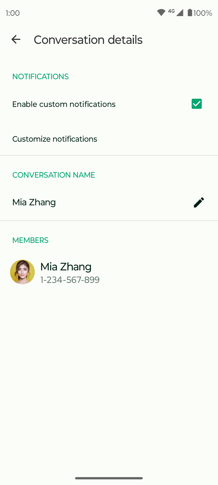

# Kosher Text.

  

Kosher Text is a trusted SMS/MMS companion, designed to make messaging simpler and more pleasant.

**Stay connected**  
Send SMS and MMS, use group conversations, and share photos, emojis, and quick replies.

**Block what you do not want**  
Block senders and phrases, and export or import block lists for backup.

**Back up conversations**  
Export and import messages so you can move devices without losing important threads.

**Lightweight**  
Small install size with fast, everyday performance.

**Privacy-friendly**  
No ads, no tracking; messaging works without needing the internet for core SMS. MMS may use the network as required by your carrier.

**Search and a clear UI**  
Find messages quickly, with a clean layout and optional dark theme.

This project is open source. Build it from this repository, review the code, and use it the way you prefer.

